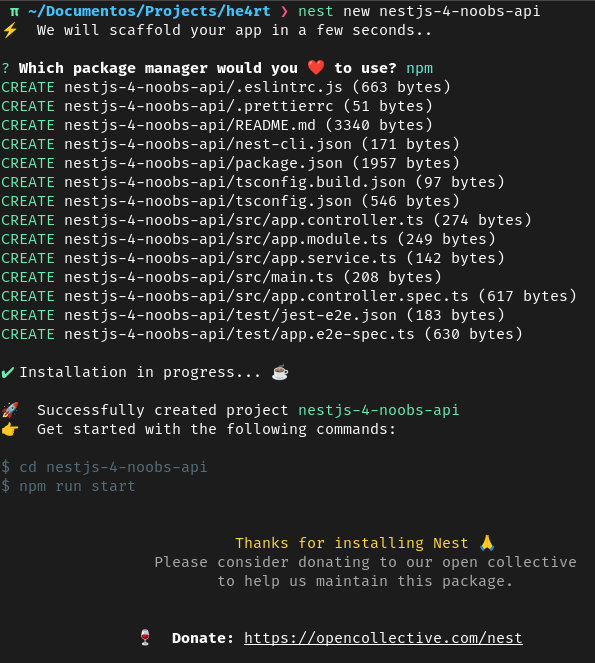
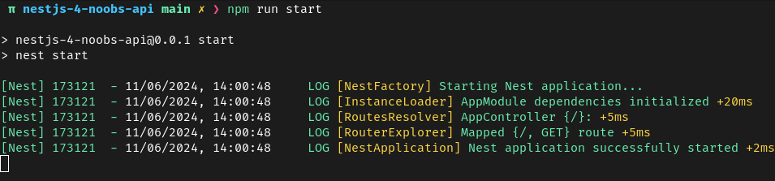

# Primeiros passos

Para criar um projeto é simples basta executar:

```bash
nest new project-name
```

O Nest CLI irá realizar uma pergunta básica de configuração relacionado ao gerenciador de pacotes que irá ser usado por padrão, aqui eu escolhi o `npm` mas fique a vontado para escolher o seu. Após a escolha o CLI irá fazer o trabalho de configurar e gerar todos os arquivos necessários para o funcionamento do projeto.



No repositório que foi criado com o processo, são gerados arquivos de configuração relacionadas a algumas ferramentas vinculadas a aplicação, e o diretório `src` composto por arquivos escenciais para o funcionamento básico da aplicação.

```txt
src
  |-- app.controller.spec.ts
  |-- app.controller.ts
  |-- app.module.ts
  |-- app.service.ts
  |-- main.ts
```

| Arquivo                  | Sobre                                                                                                     |
| ------------------------ | --------------------------------------------------------------------------------------------------------- |
| `app.controller.spec.ts` | Modulo de teste do controller                                                                             |
| `app.controller.ts`      | Controller básico com uma rota                                                                            |
| `app.module.ts`          | Módulo raiz da aplicação                                                                                  |
| `app.service.ts`         | Service básico com um único método                                                                        |
| `main.ts`                | Arquivo de entrada da aplicação que usa a função principal NestFactory para criar uma instância do Nest.  |

Sendo o arquivo de entrada, o `main.ts` inclui uma função que inicializa a aplicação.

```typescript
import { NestFactory } from '@nestjs/core';
import { AppModule } from './app.module';

async function bootstrap() {
  const app = await NestFactory.create(AppModule);
  await app.listen(300);
}
bootstrap();
```

Para criar uma instancia do aplicativo Nest, a classe principal `NestFactory` que expõe métodos estaticos e permitem a criação da instancia do aplicativo. o metodo `create()` retorna um objeto que preenche a interface `INestApplication`. Este objeto fornece um conjunto de métodos que serão descritos nos próximos capítulos. No exemplo acima, simplesmente o `HTTP` é iniciado, e permite que o aplicativo aguarde solicitações de entrada.

Para dar um start no projeto criado basta executar:

```bash
cd project-name
npm run start
```

O sistema irá executar uma transpilação do TypeScript e excutar os endpoits criados imprimindo na tela os ativos:



Agora basta acessar em seu navegador o [http://localhost:3000/](http://localhost:3000/), você deverá ver a mensagem `Hello World!` na tela.

Para Executar a aplicação em modo de obsevação (watch mode) recarregando a mesma após qualquer alteração no código, basta executar `npm start:dev` no terminal, esse modo auxilia o desenvolvedor e aumenta a produtividade.

---
[<< Anterior](./1-introducao.md) [Próximo >>](./3-controllers.md)
