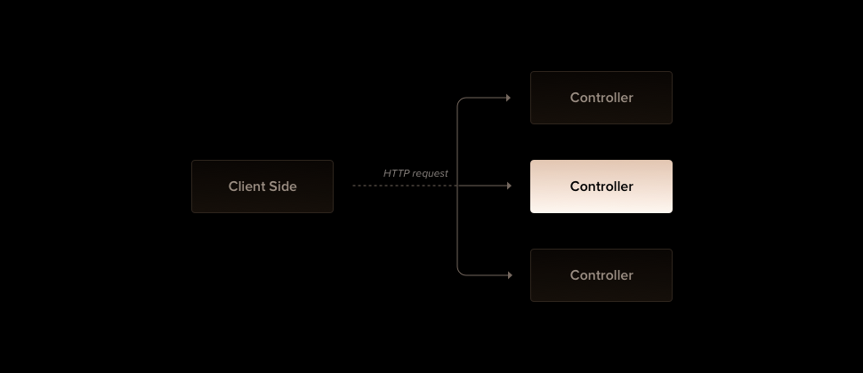

# Controllers

Os controllers são classes responsáveis por receber solicitações e retornar respostas ao cliente atrevés do protocolo `HTTP`.

O `HTTP` é um protocolo de camada de aplicação que serve para comunicação entre navegadores e servidores web, mais detalhes sobre este protocolo recomendo acessar [MDN web docs](https://developer.mozilla.org/pt-BR/docs/Web/HTTP).


> Imagem tirada da documentação oficial

O mecanismo de roteamento gerencia qual controller recebe quais solicitações.

Para criar um controller básico utilizamos classes e decorators. Os decorators realizam a função de associação das classes à metadados necessários que permitem que o Nest crie um mapeamento que vincule às solicitações aos seus devidos controllers.

## Roteamento

No exemplo a seguir usamos o decorator `@Controller()` ele é necessário para definir o controller básico do módulo, nele especificaremos um prefixo de caminho de rota opcional no caso `user`. O prefixo usado no decorator permite o agrupamento facilitado de um conjunto de rotas minimizando códigos repetitivos. Por exemplo ao indicarmos o prefixo estamos indicando que toda a rota do controller usará o prefixo `/user` isso fará que todas as rotas do módulo User ao serem chamadas tenha o padrão `/user/[rota]` evitando a redundância desse prefixo todas às vezes que criarmos uma nova rota.

```typescript
import { Controller, Get } from '@nestjs/common';

@Controller('users');
export class UserController {
  @Get()
  index(): string {
    return 'Essa ação retorna todos os usuários';
  }
}
```

O decorator `@Get()` indica o método HTTP que corresponde aquela chamada específica, indica ao Nest a criação do endpoint no qual corresponde ao verbo HTTP e ao caminho da rota. A rota para um manipulador é determinado pela concatenação do prefixo indicado no decorator `@Controller()` e qualquer caminho especificado no decorator do método seja ele `GET`, `POST`, `PUT`, `PATCH` ou `DELETE`.

No exemplo como foi declarado um prefixo `user` e não foi adicionado nenhuma informação no caminho do método, o Nest mapeará como `GET /user` para acessar o método index declarado. Conforme mencionado, caso seja adicionado ao método alguma informação do caminho, por exemplo: `@Get('name')` será produzido um mapeamento de rota como `GET /user/name`.

No exemplo quando a solicitação GET é feita para o endpoint, o Nest roteia a solicitação para nosso método definido como `index()`. O nome do método aqui é completamente arbitrário, obviamente é necessário declarar um método ao gerar uma rota, mas o Nest não atribui nenhum significado ao nome escolhido.

Este método retorna um status `200` e a resposta associada, que nesse caso é apenas uma string `Essa ação retorna todos os usuários`. Por padrão o Nest trata todos os retornos verificando o tipo, quando as funções retornam como resposta um objeto ou um array JavaScript esse retorno será serializado automaticamente para JSON, mas quando é retornado um tipo primitivo - por exemplo `string`, `number`, `boolean` - o Nest enviará apenas o valor sem tentar serializá-lo simplificando o tratamento da resposta, para nós basta retornar o valor, o Nest cuida do resto. Além disso, ele também retorna o código de status que sempre é padronizado para `200` exceto em métodos `POST` que usam `201`.

Este é o comportamento padrão no Nest, mas o framework abre a possibilidade de manipular os métodos e retornos através de bibliotecas específicas configuradas como, por exemplo o Express que pode ser injetado usando o decorator `@Res()` na assinatura do método (por exemplo, `findAll(@Res() response)`). Com esse recurso obtemos a capacidade de usar métodos de manipulação de resposta nativos expostos. Por exemplo, como o Express pode ser construídas respostas usando o código `response.status(200).send()`.

## Object Request

Os manipuladores geralmente precisam acessar os detalhes do request do cliente. O Nest fornece acesso ao objeto de solicitação da plataforma subjacente (Express por padrão). Podendo acessar o objeto de solicitação instruindo o Nest a injetá-lo adicionando o decorator `@Req()` à assinatura do manipulador.

```typescript
import {  Controller, Get, Req } from '@nestjs/common';
import {  Request } from 'express';

@Controller('users')
export class UsersController {
  @Get()
  findAll(@Req() request: Request): string {
    return 'Esta ação retorna todos os usuários';
  }
}
```

O object request representa a solicitação HTTP e tem como propriedades para string de consulta da solicitação, parâmetros, cabeçalhos e corpo. Na maioria dos casos, não é necessário pegar essas propriedades manualmente. Podemos usar decorators dedicados, como `@Body()` ou `@Query()`, que estão disponíveis prontos para uso. Abaixo está uma lista dos decorators fornecidos e os objetivos específicos da plataforma simples que eles representam.

| Decorator                | Representação                      |
| ------------------------ | ---------------------------------- |
| `@Request()`, `@Req()`   | `req`                              |
| `@Response()`, `@Res()*` | `res`                              |
| `@Next()`                | `next`                             |
| `@Session()`             | `req.session`                      |
| `@Param(key?: string)`   | `req.params` / `req.params[key]`   |
| `@Body(key?: string)`    | `req.body` / `req.body[key]`       |
| `@Query(key?: string)`   | `req.query` / `req.query[key]`     |
| `@Headers(key?: string)` | `req.headers` / `req.headers[key]` |
| `@Ip()`                  | `req.ip`                           |
| `@HostParam()`           | `req.hosts`                        |

Para compatibilidade com tipagens em plataformas HTTP subjacentes (por exemplo, Express e Fastify), o Nest fornece os decorators `@Res()` e `@Response()`. `@Res()` é simplesmente um alias para `@Response()`. Ambos expõem diretamente a interface do objeto da plataforma nativa `response`. Ao usá-los, deve-se importar as tipagens para a biblioteca implícitas (por exemplo, `@types/express`) para aproveitar ao máximo. Observe que quando injetado o `@Res()` em `@Response()` um manipulador de método, o Nest é colocado no modo específico da biblioteca para esse manipulador e se torna responsável por gerenciar a resposta. Ao fazer isso, deve ser emitido algum tipo de resposta fazendo uma chamada no object `response` (por exemplo, `res.json(...)` ou `res.send(...)`), ou o servidor HTTP travará.

## Recursos

Anteriormente, definimos um endpoint para buscar o recurso users (rota `GET`). Normalmente, também queremos fornecer um endpoint que crie novos registros. Para isso, vamos criar o manipulador `POST`:

```typescript
import { Controller, Get, Post } from '@nestjs/common';

@Controller('users')
export class UsersController {
  @Post()
  create(): string {
    return 'Esta ação adiciona um novo usuário'
  }

  @Get()
  findAll(@Req() request: Request): string {
    return 'Esta ação retorna todos os usuários';
  }
}
```

É simples assim. O Nest fornece decorators para todos os métodos HTTP padrão `@Get()`, `@Post()`, `@Put()`, `@Delete()`, `@Patch()`, `@Options()` e `@Head()`. Além disso, `@All()` define um endpoint que manipula todos eles.

## Curingas de rota

Rotas baseadas em padrões também são suportadas. Por exemplo, o asterisco é usado como curinga e corresponderá a qualquer combinação de caracteres.

```typescript
@Get('ab*cd')
findAll() {
  return 'Esta rota usa um curinga';
}
```

O `ab*cd` caminho da rota corresponderá a `abcd`, `ab_cd`, `abecd`, e assim por diante. Os caracteres `?`, `+`, `*` e `()` podem ser usados em um caminho de rota e são subconjuntos de suas contrapartes de expressão regular. O hífen (`-`) e o ponto (`.`) são interpretados literalmente por caminhos baseados em string.

> Observação
> Um curinga no meio da rota só é suportado pelo Express.

## Cabeçalhos

Para especificar um cabeçalho de resposta personalizado, pode ser usado o decorator `@Header()` ou um object response específico da biblioteca (e chamar `res.header()` diretamente).

```typescript
@Post()
@Header('Cache-Control', 'none')
create() {
  return 'Esta ação adiciona um novo usuário';
}
```

## Redirecionamento

Para redirecionar uma resposta para uma URL específica, você pode usar o decorator `@Redirect()` ou um object response específico da biblioteca (e chamar `res.redirect()` diretamente).

`@Redirect()` recebe dois argumentos, `url` e `statusCode`, ambos são opcionais. o valor padrão de `statusCode` é `302` (`Found`) se omitido.

```typescript
@Get()
@Redirect('https://nestjs.com', 301)
```

Os valores retornados substituirão quaisquer argumentos passados ao decorator `@Redirect()`. Por exemplo:

```typescript
@Get('docs')
@Redirect('https://docs.nestjs.com', 302)
getDocs(@Query('version') version) {
  if(version && version === '5') {
    return { url: 'https://docs.nestjs.com/v5/' }
  }
}
```

## Parâmetros de rota

Rotas com caminhos estáticos não funcionarão quando você precisar aceitar dados dinâmicos como parte da solicitação (por exemplo, `GET /users/1` para obter usuário com o id `1`). Para definir rotas com parâmetros, pode-se adicionar tokens de parâmetro de rota no caminho da rota para capturar o valor dinâmico naquela posição na URL da solicitação. O token de parâmetro de rota no `@Get()` exemplo de decorator abaixo demonstra esse uso. Parâmetros de rota declarados dessa forma podem ser acessados usando o decorator `@Param()`, que deve ser adicionado à assinatura do método.

```typescript
@Get(':id')
findOne(@Param() params: any): string {
  console.log(params.id);
  return `Esta ação retorna um #${params.id} usuário`;
}
```

O decorator `@Param()` é usado para capturar os parâmetros para o método (`params` no exemplo acima), e retorna os parâmetros de rota disponíveis como propriedades desse parâmetro de método. Como foi visto no código acima, pode se acessar o parâmetro `id` referenciando `params.id`. Você também pode passar um token de parâmetro específico para o decorator e então referenciar o mesmo diretamente pelo nome no corpo do método.

```typescript
@Get(':id')
findOne(@Param('id') id: string): string {
  return `Esta ação retorna um #${id} usuário`;
}
```

> DICA
> Importar `Param` do pacote `@nestjs/common`

## Roteamento de subdomínio

O decorator `@Controller` pode ter a opção `host` e exigir que o host HTTP das solicitações recebidas correspondam à algum valor específico.

```typescript
@Controller({ host: 'admin.example.com' })
export class AdminController {
  @Get()
  index(): string {
    return 'Admin page';
  }
}
```

> AVISO IMPORTANTE
> Como o Fastify não oferece suporte para roteadores aninhados, o Express deve ser usado para usar roteamento do subdomínio.

Semelhante a uma rota `path`, a opção `hosts` pode usar tokens para capturar o valor dinâmico naquela posição no nome do host. O token de parâmetro do host no decorator `@Controller()` no exemplo abaixo demonstra esse uso. Os parâmetros do host declarados dessa forma podem ser acessados usando o decorator `@HostParam()`, que deve ser adicionado à assinatura do método.

```typescript
@Controller({ host: ':account.example.com' })
export class AccountController {
  @Get()
  getInfo(@HostParam('account') account: string) {
    return account;
  }
}
```

---
[<< Anterior](./2-primeiros-passos.md) [Próximo >>](./3-controllers.md.md)
